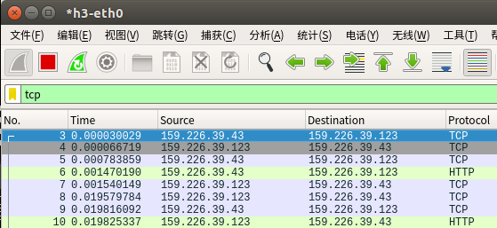

# 网络地址转换(NAT)实验
姓名：薛峰 \
学号：2016K8009908007

---
## 实验内容
* 实现 NAT 网络地址转换\
    1.NAT地址翻译：对于到达的合法数据包, 进行 IP 和 P ort 转换操作, 更新头部字段, 并转发数据包；对于到达的非法数据包，回复ICMP Destination Host Unreachable；
 \
    2.NAT 映射表维护：维护 NAT 连接映射表, 支持映射的添加、查找、更新和老化操作。
* SNAT实验：\
    运行给定网络拓扑，在n1上运行nat程序，在h3上运行HTTP服务，在h1, h2上分别访问h3的HTTP服务。
* DNAT实验：\
    运行给定网络拓扑，在n1上运行nat程序，在h1, h2上分别运行HTTP Server，在h3上分别请求h1, h2页面。
* 手动构造一个包含两个nat的拓扑：\
    h1 <-> n1 <-> n2 <-> h2，节点n1作为SNAT， n2作为DNAT，主机h2提供HTTP服务，主机h1穿过两个nat连接到h2并获取相应页面。

---
## 实验流程
### 1. `static int get_packet_direction(char *packet)`函数
>该函数的作用是判断数据包的方向，当源地址为内部地址，且目的地址为外部地址时，方向为DIR_OUT当源地址为外部地址，且目的地址为external_iface地址时，方向为DIR_IN。
```c
static int get_packet_direction(char *packet)
{
    struct iphdr *ip_hdr = packet_to_ip_hdr(packet);
    u32 src_addr = ntohl(ip_hdr->saddr);
    u32 dest_addr = ntohl(ip_hdr->daddr);

    rt_entry_t *src_entry = longest_prefix_match(src_addr);
    rt_entry_t *dest_entry = longest_prefix_match(dest_addr);
	
    if(src_entry->iface == nat.internal_iface && dest_entry->iface == nat.external_iface)
        return DIR_OUT;
    else if(src_entry->iface == nat.external_iface && dest_addr == nat.external_iface->ip)
        return DIR_IN;
    return DIR_INVALID;
}
```
### 2. `void do_translation(iface_info_t *iface, char *packet, int len, int dir)`函数
>该函数的作用是完成数据包的转换。首先判断数据包的方向。如果是DIR_OUT，那么查找是否已经存在映射，如果不存在，则建立映射，最后更新头部字段，将包转发出去；如果是DIR_IN，那么查找是否已经存在映射，如果不存在，则需要根据rule建立映射，然后更新头部信息，转发数据包，如果查找rule失败，则回复ICMP Destination Host Unreachable。
```c
void do_translation(iface_info_t *iface, char *packet, int len, int dir)
{
    //fprintf(stdout, "TODO: do translation for this packet.\n");
    pthread_mutex_lock(&nat.lock);
    int find = 0;
    struct iphdr  *ip_hdr  = packet_to_ip_hdr(packet);
    struct tcphdr *tcp_hdr = packet_to_tcp_hdr(packet);
    u32 daddr = ntohl(ip_hdr->daddr);
    u32 saddr = ntohl(ip_hdr->saddr);
    u16 sport = ntohs(tcp_hdr->sport);
    u16 dport = ntohs(tcp_hdr->dport);
    struct nat_mapping *mapping_entry, *q;

    if(dir == DIR_OUT) {
        printf("DIR_OUT\n");
        struct list_head *head = &nat.nat_mapping_list[hash8((char*)&daddr, sizeof(daddr))];
        // Find if there's already the corresponding mapping
        list_for_each_entry_safe(mapping_entry, q, head, list) {
            if(mapping_entry->remote_ip == daddr) {
                find = 1;
                break;
            }
        }

        // If not dind, build a new mapping
        if(!find) {
            struct nat_mapping *new_mapping = (struct nat_mapping *)malloc(sizeof(struct nat_mapping));
            new_mapping->remote_ip     = daddr;
            new_mapping->remote_port   = dport;
            new_mapping->internal_ip   = saddr;
            new_mapping->internal_port = sport;
            new_mapping->external_ip   = nat.external_iface->ip;
            new_mapping->external_port = assign_external_port();
            new_mapping->update_time = 0;
            memset(&new_mapping->conn, 0, sizeof(struct nat_connection));
            list_add_tail(&new_mapping->list, &mapping_entry->list);
            mapping_entry = new_mapping;
        }
    }
    else if(dir == DIR_IN) {
        printf("DIR_IN\n");
        struct list_head *head = &nat.nat_mapping_list[hash8((char*)&saddr,sizeof(saddr))];
        // Find if there's already the corresponding mapping
        list_for_each_entry_safe(mapping_entry, q, head, list) {
            if(mapping_entry->remote_ip == saddr/* && mapping_entry->remote_port ==*/ ) {
                find = 1;
                break;
            }
        }

        // If not find, build a new mapping according to the rules	
        if(!find) {
            int rule_find = 0;
            struct dnat_rule *rule_entry, *rule_q;
            list_for_each_entry_safe(rule_entry, rule_q, &nat.rules, list) {
                if(rule_entry->external_ip == daddr && rule_entry->external_port == dport) {
                    rule_find = 1;
                break;
                }
            }
            if(rule_find == 0)
                icmp_send_packet(packet, len, ICMP_DEST_UNREACH, ICMP_HOST_UNREACH);

            struct nat_mapping *new_mapping = (struct nat_mapping *)malloc(sizeof(struct nat_mapping));
            new_mapping->remote_ip     = saddr;
            new_mapping->remote_port   = sport;
            new_mapping->internal_ip   = rule_entry->internal_ip;
            new_mapping->internal_port = rule_entry->internal_port;
            new_mapping->external_ip   = rule_entry->external_ip;
            new_mapping->external_port = rule_entry->external_port;
            new_mapping->update_time   = 0;
            memset(&new_mapping->conn,0,sizeof(struct nat_connection));
            list_add_tail(&new_mapping->list, &mapping_entry->list);
            mapping_entry = new_mapping;
        }
    }
    else
        icmp_send_packet(packet, len, ICMP_DEST_UNREACH, ICMP_HOST_UNREACH);

    update_send_packet(packet, mapping_entry, len, dir);

    pthread_mutex_unlock(&nat.lock);
    return;
}
```
其中`void update_send_packet(char *packet, struct nat_mapping *mapping_entry, int len, int dir)`函数的作用是更新IP/TCP数据包头部字段并发送数据包。
```c
void update_send_packet(char *packet, struct nat_mapping *mapping_entry, int len, int dir)
{
    struct iphdr  *ip_hdr  = packet_to_ip_hdr(packet);
    struct tcphdr *tcp_hdr = packet_to_tcp_hdr(packet);

    // Update the mapping
    if(tcp_hdr->flags & TCP_FIN)
        mapping_entry->conn.external_fin = 1;
    if(tcp_hdr->flags & TCP_ACK)
        mapping_entry->conn.external_ack = 1;
    if(tcp_hdr->flags & TCP_RST) {
        mapping_entry->conn.external_fin = 1;
        mapping_entry->conn.external_ack = 1;
        mapping_entry->conn.internal_fin = 1;
        mapping_entry->conn.internal_ack = 1;
	}

    // Update and send the packet
    if(dir == DIR_OUT) {
        ip_hdr->saddr = htonl(nat.external_iface->ip);
        tcp_hdr->sport = htons(mapping_entry->external_port);
    }
    else if (dir == DIR_IN) {
        ip_hdr->daddr = htonl(mapping_entry->internal_ip);
        tcp_hdr->dport = htons(mapping_entry->internal_port);
    }
    tcp_hdr->checksum = tcp_checksum(ip_hdr, tcp_hdr);
    ip_hdr->checksum = ip_checksum(ip_hdr);
    ip_send_packet(packet, len);
}
```
另外，`u16 assign_external_port()`函数的作用是分配可用的port。
```c
u16 assign_external_port()
{
    int i;
    for(i = NAT_PORT_MIN; i < NAT_PORT_MAX; ++i) {
        if (!nat.assigned_ports[i]){
            nat.assigned_ports[i] = 1;
            break;
        }
    }
    return i;
}
```
### 3. `void *nat_timeout()`函数
>该函数的作用是实现NAT老化操作。双方都已发送FIN且回复相应ACK的连接，一方发送RST包的连接，可以直接回收；双方已经超过60秒未传输数据的连接，认为其已经传输结束，可以回收。
```c
void *nat_timeout()
{
    int i = 0;
    while (1) {
        //fprintf(stdout, "TODO: sweep finished flows periodically.\n");
        sleep(1);
        pthread_mutex_lock(&nat.lock);

        for (i = 0; i < HASH_8BITS; i++) {
            struct list_head *head = &nat.nat_mapping_list[i];
            struct nat_mapping *mapping_entry, *q;
            list_for_each_entry_safe(mapping_entry, q, head, list) {
                mapping_entry->update_time ++;
                if(is_flow_finished(&mapping_entry->conn) || mapping_entry->update_time >= TCP_ESTABLISHED_TIMEOUT)
                list_delete_entry(&mapping_entry->list);
            }
        }

        pthread_mutex_unlock(&nat.lock);
    }
    return NULL;
}
```
### 4. `void nat_exit()`函数
>该函数实现了退出at程序时的动作。清除每一项mapping并且结束nat_timeout进程。
```c
void nat_exit()
{
    //fprintf(stdout, "TODO: release all resources allocated.\n");
    int i = 0;
    pthread_mutex_lock(&nat.lock);

    for (i = 0; i < HASH_8BITS; i++) {
        struct list_head *head = &nat.nat_mapping_list[i];
        struct nat_mapping *p, *q;
        list_for_each_entry_safe(p, q, head, list) {
            list_delete_entry(&p->list);
            free(p);
        }
    }
    pthread_kill(nat.thread, SIGTERM);

    pthread_mutex_unlock(&nat.lock);
    return;
}
```
---
## 实验结果及分析
### 一.实验结果
<div align=center> 

#### 实验一



#### 实验二

#### 实验三


<div align=left> 

### 二.结果分析
>成功地完成了三个实验，实现了网络地址转换，不论是作为SNAT还是DNAT都具有正确的功能。此外，本次实验代码量较小，还是比较轻松的。